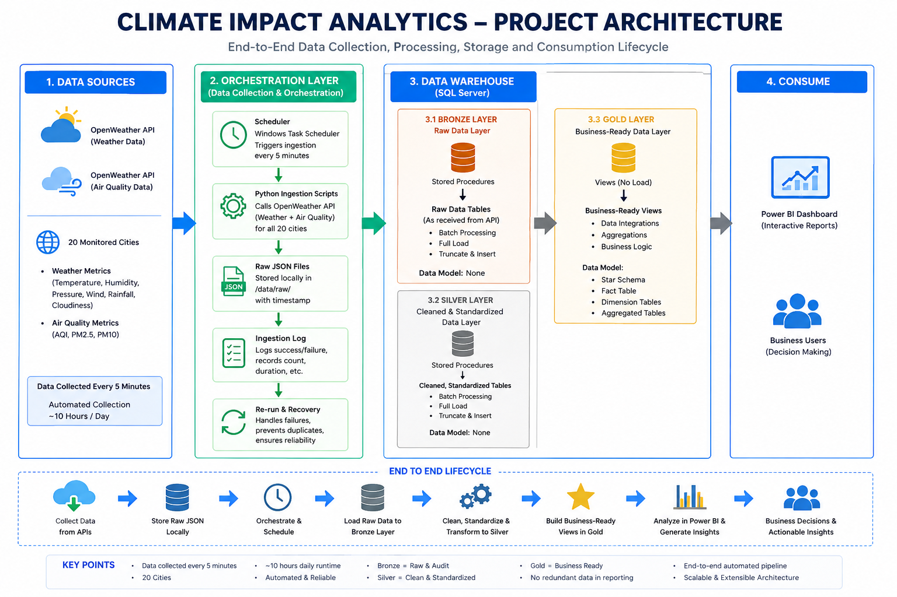
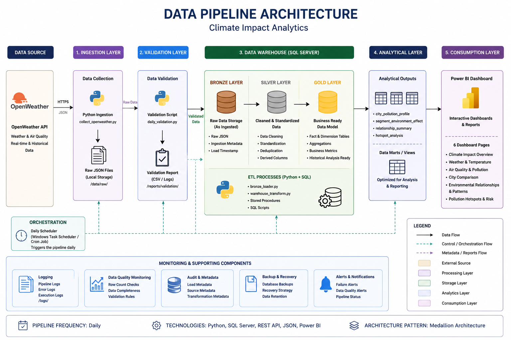
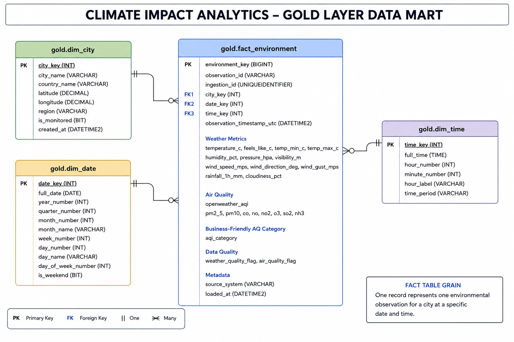
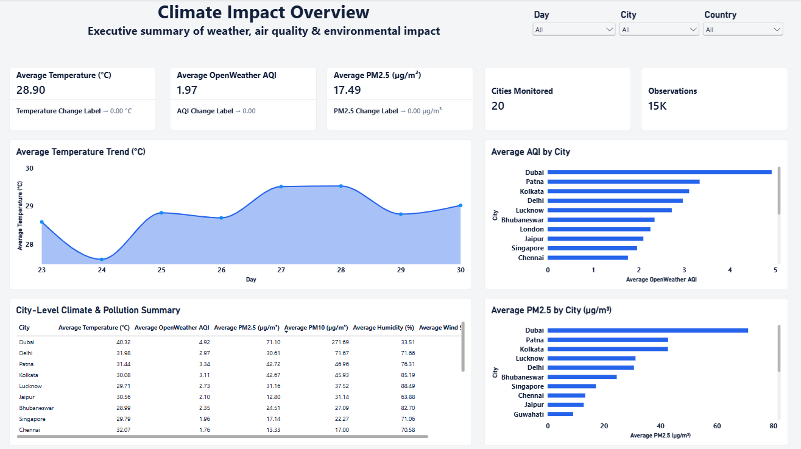
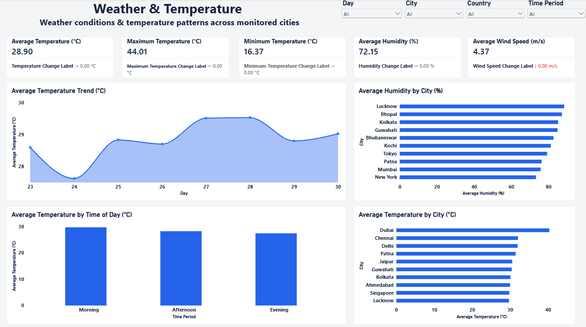
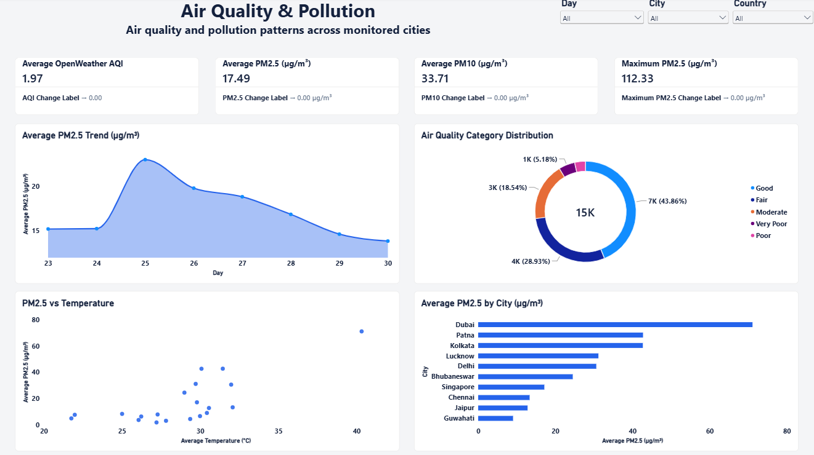
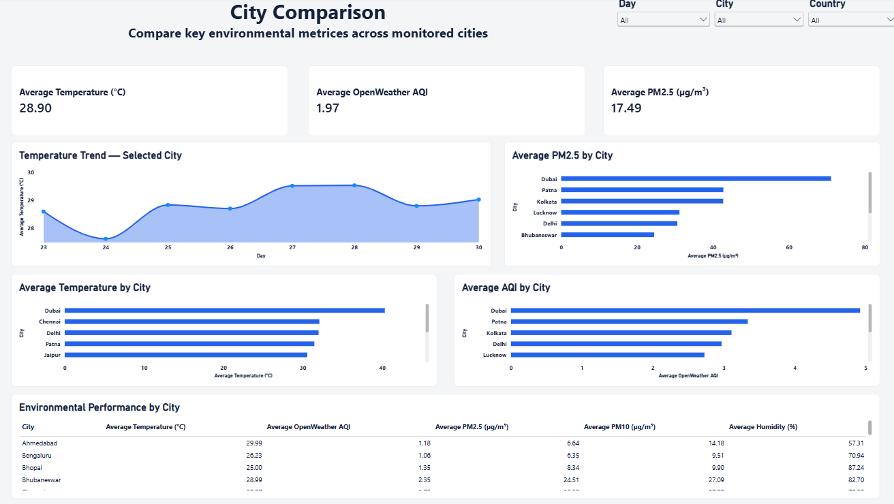
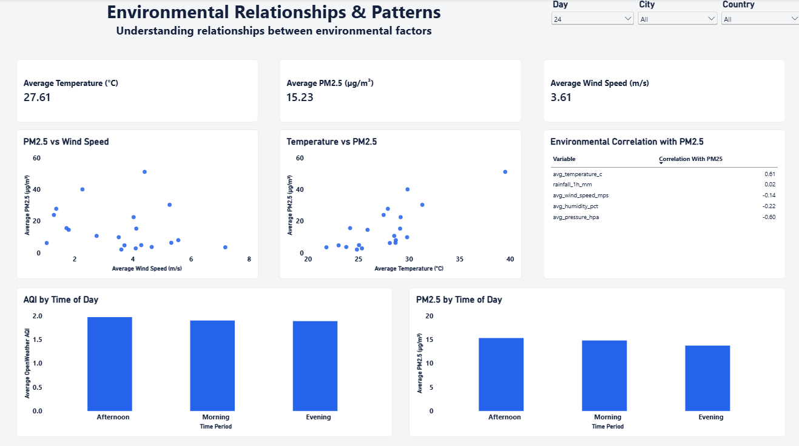
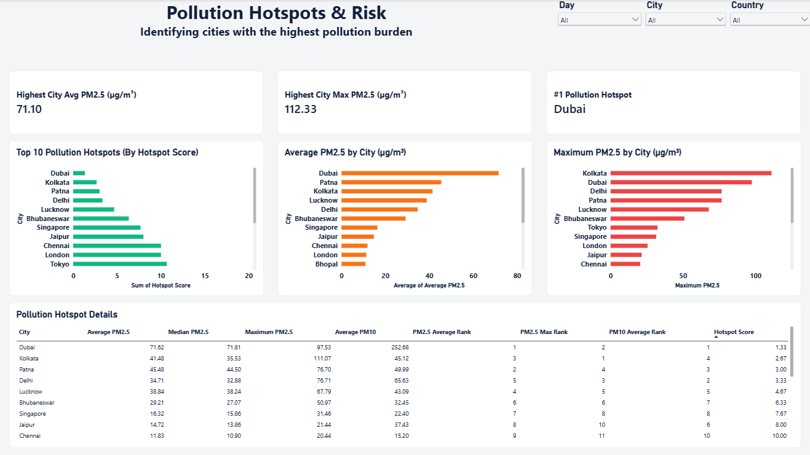

# 🌍 Climate Impact Analytics

> **End-to-end environmental analytics project combining API-based data collection, Python, SQL Server data warehousing, advanced analysis, and Power BI reporting.**

---

## 📌 Project Overview

Climate and air-quality conditions can vary significantly across cities and over time. Understanding these variations can help identify pollution hotspots, compare environmental conditions, and uncover relationships between air pollution and weather variables.

This project builds an end-to-end data analytics pipeline that collects real-time weather and air-quality data from the OpenWeather API, validates and processes the data using Python, stores and transforms it in SQL Server using a Bronze-Silver-Gold architecture, performs exploratory and advanced analysis, and presents the findings through an interactive Power BI dashboard.

The project focuses on answering practical business and analytical questions around:

- Weather conditions
- Air quality
- PM2.5 and PM10 pollution
- Pollution hotspots
- City-level environmental differences
- Environmental relationships
- Time-of-day patterns

---

# 🎯 Business Problem

Organizations monitoring environmental conditions need a reliable way to understand how weather and air-quality conditions vary across locations.

The objective of this project is to build an analytical solution that can answer questions such as:

1. Which cities have the highest pollution levels?
2. Which cities represent the biggest pollution hotspots?
3. How do PM2.5 and PM10 levels vary across cities?
4. How do temperature, humidity, pressure, wind speed, and rainfall relate to PM2.5?
5. How do environmental conditions differ between high-, moderate-, and lower-pollution cities?
6. How does air quality change across different times of day?
7. Which cities require greater environmental monitoring attention?

---

# 🎯 Project Objectives

- Collect weather and air-quality data through an API.
- Build a repeatable Python-based ingestion pipeline.
- Validate incoming environmental observations.
- Store raw data in a Bronze layer.
- Clean and standardize data in the Silver layer.
- Build a business-ready Gold layer in SQL Server.
- Perform exploratory and advanced environmental analysis.
- Identify pollution segments and hotspots.
- Analyze relationships between environmental variables and PM2.5.
- Build an interactive Power BI dashboard.
- Communicate analytical findings through business-focused visualizations.

---

# 🏗️ Project Architecture

The project follows a layered data architecture:



---

# 🔄 Data Pipeline

The complete data lifecycle is:



---

# 🧰 Technology Stack

| Area | Technology |
|---|---|
| Data Source | OpenWeather API |
| Programming | Python |
| Data Processing | Pandas |
| Database | Microsoft SQL Server |
| Data Warehouse | Bronze / Silver / Gold Architecture |
| SQL | T-SQL |
| Analysis | Pandas, Statistical Analysis |
| Visualization | Power BI |
| BI Calculations | DAX |
| Development | Jupyter Notebook |
| Version Control | Git / GitHub |

---

# 🌐 Data Source

The project uses the **OpenWeather API** to collect environmental observations.

The collected data includes:

### Weather

- Temperature
- Feels-like temperature
- Minimum temperature
- Maximum temperature
- Humidity
- Atmospheric pressure
- Visibility
- Wind speed
- Wind direction
- Wind gust
- Rainfall
- Cloudiness

### Air Quality

- OpenWeather AQI
- PM2.5
- PM10
- CO
- NO
- NO₂
- O₃
- SO₂
- NH₃

The data is collected for monitored cities and stored with observation timestamps and ingestion metadata.

---

# 🐍 Python Pipeline

The Python source code is organized into modules based on responsibility.

```text
src/
│
├── api/
│   └── openweather.py
│
├── config/
│   └── cities.py
│
├── database/
│   └── sql_server.py
│
├── ingestion/
│   └── collect_openweather.py
│
├── validation/
│   └── daily_validation.py
│
└── warehouse/
    ├── bronze_loader.py
    └── warehouse_transform.py
```

### Module responsibilities

| Module | Responsibility |
|---|---|
| `openweather.py` | Communicates with OpenWeather API |
| `cities.py` | Stores monitored city configuration |
| `sql_server.py` | Handles SQL Server connectivity/database operations |
| `collect_openweather.py` | Orchestrates environmental data collection |
| `daily_validation.py` | Performs data-quality validation |
| `bronze_loader.py` | Loads raw data into Bronze layer |
| `warehouse_transform.py` | Performs warehouse transformations |

---

# 🗄️ Data Warehouse

The SQL Server warehouse follows a **Bronze-Silver-Gold architecture**.

## Bronze Layer

Stores raw incoming environmental data with minimal transformation.

### Purpose

- Preserve source data
- Support traceability
- Maintain raw observations
- Provide a recoverable ingestion layer

---

## Silver Layer

Contains cleaned and standardized environmental data.

### Main activities

- Data cleansing
- Data standardization
- Data normalization
- Data-quality handling
- Derived columns
- Data enrichment

---

## Gold Layer

Contains business-ready analytical structures used by the analytics and Power BI layers.

### Gold tables

```text
gold.fact_environment
gold.dim_city
gold.dim_date
gold.dim_time
```

### Data model



The central fact table stores environmental observations, while the dimension tables provide city, date, and time context.

---

# 📊 Analytical Work

The analytical stage contains both exploratory and advanced analysis.

## Exploratory Analysis

The analysis examines:

- Data distributions
- Missing values
- Environmental metrics
- City-level differences
- Air-quality categories
- Weather patterns
- PM2.5 and PM10 behavior
- Time-of-day patterns

---

## Advanced Analysis

The advanced analysis focuses on identifying meaningful environmental patterns.

### City Pollution Profile

A city-level profile was created using:

- Average PM2.5
- Median PM2.5
- Maximum PM2.5
- Average PM10
- Average temperature
- Average humidity
- Average wind speed
- Observation count

---

### Pollution Segmentation

Cities were classified into:

- Lower Pollution
- Moderate Pollution
- High Pollution

This provides a simple business-friendly way to compare environmental conditions across cities.

---

### Environmental Relationships

The relationship between PM2.5 and environmental variables was analyzed using correlation.

The analysis identified:

| Environmental Variable | Correlation with PM2.5 |
|---|---:|
| Temperature | +0.612 |
| Pressure | -0.598 |
| Humidity | -0.217 |
| Wind Speed | -0.143 |
| Rainfall | +0.024 |

> **Important:** Correlation indicates association, not causation.

---

### Pollution Hotspot Analysis

A hotspot analysis combines multiple pollution indicators to identify cities with a higher overall pollution burden.

The analysis considers:

- Average PM2.5 rank
- Maximum PM2.5 rank
- Average PM10 rank
- Hotspot score

This provides a more balanced view than relying only on average PM2.5.

---

# 📈 Power BI Dashboard

The project contains a **6-page interactive Power BI dashboard**.

## Page 1 — Climate Impact Overview

Provides a high-level view of:

- Temperature
- AQI
- PM2.5
- Observation volume
- Temperature trends
- City-level environmental performance

  

---

## Page 2 — Weather & Temperature

Focuses on weather conditions:

- Average temperature
- Maximum temperature
- Humidity
- Wind speed
- Temperature trends
- Temperature by city
- Humidity by city
- Temperature by time of day

  

---

## Page 3 — Air Quality & Pollution

Focuses on air-quality conditions:

- Average AQI
- Average PM2.5
- Average PM10
- Maximum PM2.5
- PM2.5 trend
- PM2.5 by city
- AQI category distribution
- PM2.5 vs Temperature

  

---

## Page 4 — City Comparison

Provides comparative analysis across monitored cities:

- Temperature comparison
- AQI comparison
- PM2.5 comparison
- Temperature trends
- Environmental performance table

  

---

## Page 5 — Environmental Relationships & Patterns

Focuses on relationships between environmental variables:

- PM2.5 vs wind speed
- Temperature vs PM2.5
- PM2.5 by time of day
- AQI by time of day
- Environmental correlation summary

  

---

## Page 6 — Pollution Hotspots & Risk

Focuses on identifying cities with the highest pollution burden:

- Highest average PM2.5
- Highest maximum PM2.5
- Top pollution hotspot
- Top pollution hotspots
- Maximum PM2.5 by city
- Average PM2.5 by city
- Pollution hotspot details

  

---

# 💡 Key Insights

The analysis produced several notable findings.

### 1. Pollution levels vary substantially by city

Some cities show considerably higher PM2.5 and PM10 concentrations than others, highlighting significant differences in environmental conditions between locations.

### 2. Temperature showed the strongest positive relationship with PM2.5

The observed correlation between average temperature and PM2.5 was:

```text
+0.612
```

### 3. Atmospheric pressure showed a strong negative relationship

Pressure had a correlation of:

```text
-0.598
```

with PM2.5.

This makes pressure one of the strongest relationships identified in the analysis.

### 4. Wind speed showed a relatively weak negative relationship

The observed correlation was:

```text
-0.143
```

### 5. Rainfall showed almost no linear relationship

Rainfall had a correlation of approximately:

```text
+0.024
```

with PM2.5 in this dataset.

### 6. Pollution segmentation highlights different environmental profiles

Cities were grouped into lower-, moderate-, and high-pollution segments, allowing environmental conditions to be compared across these groups.

### 7. Hotspot analysis provides a broader risk perspective

Ranking cities using multiple pollution indicators provides a more comprehensive hotspot assessment than using average PM2.5 alone.

---

# 📁 Repository Structure

```text
climate-impact-analytics/
│
├── README.md
├── requirements.txt
├── .gitignore
├── .env.example
├── LICENSE
│
├── docs/
│   ├── architecture_and_data_pipeline.md
│   ├── data_catalog.md
│   ├── naming_conventions.md
│   ├── dashboard_documentation.md
│   ├── business_insights.md
│   │
│   ├── project_architecture.png
│   ├── data_pipeline_architecture.png
│   └── data_mart.png
│
├── data/
│   │
│   ├── raw/
│   │   └── openweather/
│   │       └── .gitkeep
│   │
│   ├── processed/
│   │   ├── city_pollution_profile.csv
│   │   ├── environmental_relationships.csv
│   │   ├── pollution_hotspots.csv
│   │   └── pollution_segments.csv
│   │
│   └── reports/
│       └── data_quality/
│           └── .gitkeep
│
├── logs/
│   └── .gitkeep
│
├── notebooks/
│   ├── 01_data_validation.ipynb
│   ├── 02_exploratory_analysis.ipynb
│   └── 03_advanced_analysis.ipynb
│
├── powerbi/
│   ├── Climate_Impact_Dashboard.pbix
│   │
│   └── images/
│       ├── 01_climate_impact_overview.png
│       ├── 02_weather_and_temperature.png
│       ├── 03_air_quality_and_pollution.png
│       ├── 04_city_comparison.png
│       ├── 05_environmental_relationships_and_patterns.png
│       └── 06_pollution_hotspots_and_risk.png
│
├── sql/
│   │
│   ├── init_database.sql
│   │
│   ├── bronze/
│   │   └── ddl_bronze.sql
│   │
│   ├── silver/
│   │   ├── ddl_silver.sql
│   │   └── procedure_load_silver.sql
│   │
│   ├── gold/
│   │   ├── ddl_gold.sql
│   │   └── procedure_load_gold.sql
│   │
│   └── tests/
│       └── test_silver_gold.sql
│
└── src/
    │
    ├── __init__.py
    │
    ├── api/
    │   ├── __init__.py
    │   └── openweather.py
    │
    ├── config/
    │   ├── __init__.py
    │   └── cities.py
    │
    ├── database/
    │   ├── __init__.py
    │   ├── sql_server.py
    │   └── test_connection.py
    │
    ├── ingestion/
    │   ├── __init__.py
    │   └── collect_openweather.py
    │
    ├── validation/
    │   ├── __init__.py
    │   └── daily_validation.py
    │
    └── warehouse/
        ├── __init__.py
        ├── bronze_loader.py
        └── warehouse_transform.py
```

---

# 📚 Documentation

| Document | Description |
|---|---|
| [`architecture_and_data_pipeline.md`](docs/architecture_and_data_pipeline.md) | System architecture and end-to-end data pipeline |
| [`data_catalog.md`](docs/data_catalog.md) | Gold-layer tables, columns and data structure |
| [`naming_conventions.md`](docs/naming_conventions.md) | Project-wide naming standards |
| [`dashboard_documentation.md`](docs/dashboard_documentation.md) | Power BI dashboard pages, metrics and visuals |
| [`business_insights.md`](docs/business_insights.md) | Key findings, business problems and recommended actions |

---

# ⚙️ How to Run the Project

## 1. Clone the repository

```bash
git clone <your-github-repository-url>
cd climate-impact-analytics
```

## 2. Install dependencies

```bash
pip install -r requirements.txt
```

## 3. Configure API credentials

Add your OpenWeather API key through the project's configuration/environment setup.

Do not commit API keys or other credentials to GitHub.

---

## 4. Configure SQL Server

Configure the SQL Server connection used by the project.

The database contains:

```text
Bronze
   ↓
Silver
   ↓
Gold
```

---

## 5. Run data collection

Run the Python ingestion process to collect environmental observations.

---

## 6. Run validation

Execute the validation process to check the collected data before warehouse processing.

---

## 7. Load and transform warehouse data

Run the Bronze loading and warehouse transformation processes.

---

## 8. Perform analysis

Open the notebooks in the following order:

```text
01_data_validation.ipynb
        ↓
02_exploratory_analysis.ipynb
        ↓
03_advanced_analysis.ipynb
```

---

## 9. Open the Power BI dashboard

Connect Power BI to the Gold-layer analytical tables and views and refresh the dataset.

---

# 🔐 Data & Security

API credentials and database credentials should never be committed to the repository.

Use environment variables or a local configuration file that is excluded through `.gitignore`.

Example:

```text
.env
*.key
secrets/
```

---

# 🚀 Future Improvements

Potential future enhancements include:

- Automated scheduled data ingestion
- Longer historical data collection
- Automated data-quality monitoring
- Additional environmental indicators
- More advanced statistical analysis
- Time-series forecasting when sufficient historical data is available
- Automated Power BI dataset refresh
- Cloud deployment
- Automated pipeline orchestration

---

# 👤 Project Purpose

This project was developed as an end-to-end **Data Analyst portfolio project** to demonstrate practical skills across:

- API data collection
- Python
- Data validation
- SQL
- Data warehousing
- Data modeling
- Exploratory analysis
- Statistical analysis
- Power BI
- DAX
- Business storytelling

---

# 📌 Summary

**Climate Impact Analytics** demonstrates how raw environmental API data can be transformed into a structured analytical solution:

```text
API Data
   ↓
Python
   ↓
Validation
   ↓
SQL Server
   ↓
Bronze
   ↓
Silver
   ↓
Gold
   ↓
Advanced Analytics
   ↓
Power BI
   ↓
Business Insights
```

The final solution combines data engineering concepts with data analysis and business intelligence to provide a complete view of weather and air-quality conditions across cities.
