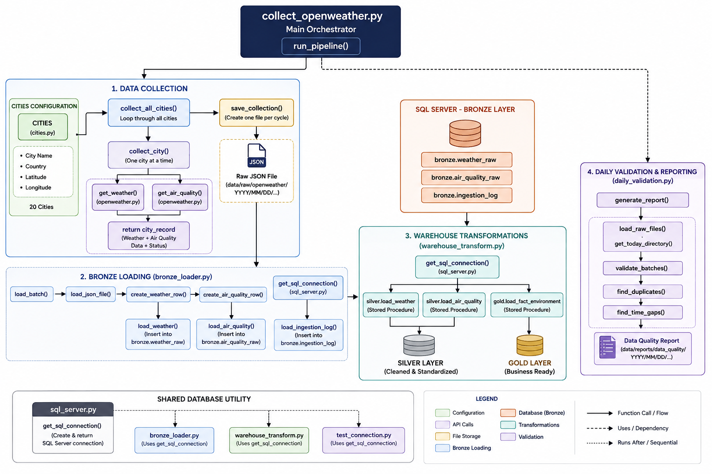

# System Architecture & Data Pipeline

## Overview

The Climate Impact Analysis project is an end-to-end analytics pipeline that collects weather and air-quality data from the OpenWeather API, validates and processes the data through a layered SQL Server warehouse, performs analysis, and delivers business insights through Power BI.

## Architecture


## End-to-End Data Flow

```text
OpenWeather API
       ↓
Python Data Collection
       ↓
Data Validation
       ↓
Bronze Layer
       ↓
Silver Layer
       ↓
Gold Layer
       ↓
Analytical Notebooks
       ↓
Power BI
       ↓
Business Insights
```

## 1. Source Layer

**OpenWeather API**

Provides weather and air-quality observations for the monitored cities.

Main data includes:

- Temperature and feels-like temperature
- Humidity and pressure
- Wind and rainfall
- AQI
- PM2.5 and PM10
- Other air-quality measurements

## 2. Python Application Layer

Python handles data collection, validation, database connectivity, and warehouse processing.

```text
src/
├── api/
│   └── openweather.py
├── config/
│   └── cities.py
├── database/
│   └── sql_server.py
├── ingestion/
│   └── collect_openweather.py
├── validation/
│   └── daily_validation.py
└── warehouse/
    ├── bronze_loader.py
    └── warehouse_transform.py
```

### Module Responsibilities

| Module | Responsibility |
|---|---|
| `cities.py` | Maintains monitored city configuration |
| `openweather.py` | Handles API communication |
| `collect_openweather.py` | Coordinates data collection |
| `daily_validation.py` | Performs data-quality checks |
| `sql_server.py` | Provides SQL Server connectivity |
| `bronze_loader.py` | Loads data into Bronze |
| `warehouse_transform.py` | Processes warehouse layers |





## 3. Data Collection & Runtime

The collection process is coordinated by `collect_openweather.py`.

For each collection cycle:

```text
cities.py
    ↓
collect_openweather.py
    ↓
openweather.py
    ↓
OpenWeather API
    ↓
Raw JSON
```

The pipeline:

- Reads the monitored cities from `cities.py`
- Sends weather and air-quality requests to OpenWeather API
- Collects data for all monitored cities
- Saves each collection cycle as a raw JSON file
- Runs every **5 minutes**
- Continues for a maximum of **10 hours**

This creates a time-series dataset for analyzing changes in weather and air quality.

## 4. Data Validation

After collection, the raw data is validated before warehouse processing.

`daily_validation.py` checks:

- Expected city coverage
- Batch structure
- Duplicate ingestion IDs
- Time gaps between collection cycles
- Weather API success rate
- Air-quality API success rate

```text
Raw JSON
    ↓
Daily Validation
    ↓
PASS / WARNING / ERROR
```

A JSON data-quality report is generated for the validation results.

## 5. SQL Server Warehouse

Validated data moves through a layered architecture:

```text
Bronze
  ↓
Silver
  ↓
Gold
```

### Bronze Layer

Stores the collected weather and air-quality data in raw warehouse tables.

### Silver Layer

Cleans, standardizes, and prepares the Bronze data for analytical use.

### Gold Layer

Provides structured, business-ready data for analysis and reporting.

The main Gold model contains:


### Gold Tables

```text
gold.fact_environment
gold.dim_city
gold.dim_date
gold.dim_time
```

- `fact_environment` — environmental observations
- `dim_city` — city and geographic information
- `dim_date` — calendar attributes
- `dim_time` — time-of-day attributes

## 6. Warehouse Transformation

`warehouse_transform.py` coordinates the SQL Server transformations:

```text
Bronze
   ↓
Silver Weather
   +
Silver Air Quality
   ↓
Gold Fact Environment
```

The transformation is committed after successful execution. If an error occurs, the transaction is rolled back.

## 7. Analytical Layer

The Gold layer feeds the Jupyter notebooks:

```text
01_data_validation.ipynb
        ↓
02_exploratory_analysis.ipynb
        ↓
03_advanced_analysis.ipynb
```

The analysis covers:

- Exploratory analysis
- City pollution profiles
- Environmental relationships
- Pollution segmentation
- Pollution hotspot analysis

Key analytical outputs include:

```text
city_pollution_profile
segment_environment_effect
relationship_summary
hotspot_analysis
```

## 8. Power BI Layer

The prepared data and analytical outputs are used to build the Power BI dashboard.

The dashboard contains six pages:

1. Climate Impact Overview
2. Weather & Temperature
3. Air Quality & Pollution
4. City Comparison
5. Environmental Relationships & Patterns
6. Pollution Hotspots & Risk

## 9. Data Lineage

```text
OpenWeather API
       │
       ▼
Python Ingestion
       │
       ▼
Raw JSON
       │
       ▼
Validation
       │
       ▼
Bronze
       │
       ▼
Silver
       │
       ▼
Gold
       │
       ▼
Analysis
       │
       ▼
Power BI
       │
       ▼
Business Insights
```

## 10. Orchestration

The project does not use a separate enterprise orchestration platform.

The Python ingestion workflow coordinates the main processing sequence:

```text
City Configuration
       ↓
API Collection
       ↓
Raw JSON Storage
       ↓
Validation
       ↓
Bronze Loading
       ↓
Bronze → Silver → Gold
       ↓
Analysis / Power BI
```

The collection process runs on a **5-minute interval for up to 10 hours**.


## 11. Key Architecture Principles

- **Layered processing:** Bronze → Silver → Gold
- **Data quality:** Validation before downstream processing
- **Separation of concerns:** Each Python module has a specific responsibility
- **Time-series collection:** Repeated API collection creates historical observations
- **Traceability:** Data can be followed from API source to dashboard
- **Business-ready output:** Gold provides structured data for analytics and reporting

## Summary

The architecture separates the project into clear stages:

**Collect → Validate → Store → Transform → Analyze → Visualize → Decide**

The result is a repeatable pipeline that transforms raw environmental API data into structured analytical data and business insights.
